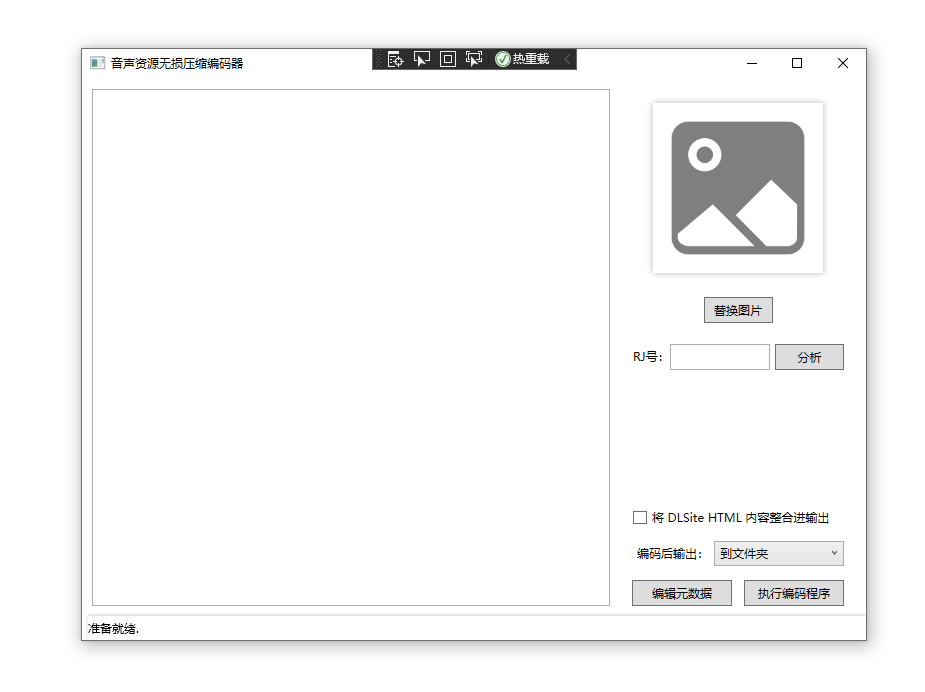

# Cardinal-JV-Archive-Make

Cardinal Japanese Voice Archive Maker
音声归档制作工具

用来转换 `wav` 格式的音声文件为 `flac` 格式的归档压缩文件信息的工具，目的是提供小体积，易于检索的无损音声保存方式。
目前正在开发中

## 计划
- [ ] 实现 `wav`、`mp3` 等到 `flac` 格式的转换
- [ ] 实现编辑 `flac metadata` 将作者，封面等信息嵌flac文件
- [ ] 实现根据 RJ 号从 DLSite 抓取描述信息进行补全
- [ ] 实现根据描述信息生成 HTML 格式的 `README.html`
- [ ] 实现在 `README.html` 中内嵌一个播放器，并支持频谱、歌词显示等功能
- [ ] ~~或许做个i18n？~~